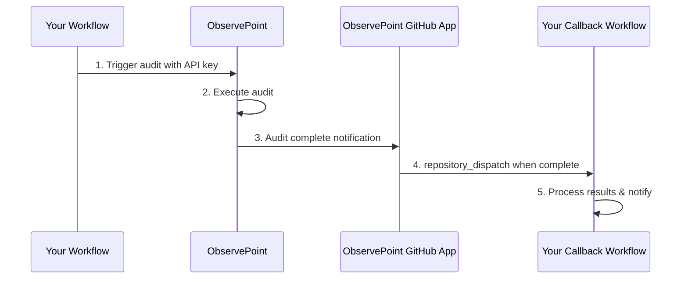

# ObservePoint GitHub Actions Integration

A GitHub Action that seamlessly integrates ObservePoint audits into your CI/CD pipeline, automatically triggering audits and handling results through callback workflows.

## 🚀 Features

- **Automated Audit Execution**: Trigger ObservePoint audits directly from your GitHub workflows
- **Secure Integration**: Uses encrypted secrets and fine-grained permissions
- **Callback Support**: Automatically triggers follow-up workflows when audits complete via repository dispatch
- **PR Integration**: Works seamlessly with pull request workflows
- **Organization Whitelisting**: Secure access control through pre-approved GitHub organizations

## 🔄How It Works



1. **Trigger Audit**: GitHub Action calls ObservePoint API with your audit configuration
2. **Execute Audit**: ObservePoint runs the specified audit on your URLs
3. **Audit Complete Notification**: ObservePoint notifies the ObservePoint GitHub App upon completion
4. **Repository Dispatch**: The ObservePoint GitHub App triggers your callback workflow via GitHub repository dispatch event
5. **Process Results**: Your callback workflow handles the results and can notify your team

> ⚠️ **Important**: To ensure proper access control, customers must contact ObservePoint customer support to provide their GitHub organization name for whitelisting before using this integration.

---

## 📋Prerequisites

Before getting started, ensure you have:

- [ ] Active ObservePoint account with API access
- [ ] GitHub organization whitelisted with ObservePoint (see Step 1 below)
- [ ] ObservePoint Audit ID - found in the URL of your audit's page
- [ ] GitHub repository with Actions enabled
- [ ] Repository admin access for secrets management

## 🔍 Finding Your Audit ID

1. Log in to ObservePoint
2. Navigate to your desired audit
3. The Audit ID is in the URL: `https://app.observepoint.com/audits/{AUDIT_ID}`

---

## ⚙️ Setup & Configuration

### Step 1: Whitelist Your GitHub Organization

**⚠️ IMPORTANT**: Before using this integration, your GitHub organization must be whitelisted by ObservePoint.

1. Contact your ObservePoint customer support team
2. Provide your **exact GitHub organization name** (case-sensitive)
    - Find this in your repository URL: `https://github.com/{ORGANIZATION_NAME}/repo-name`
    - Example: For `https://github.com/acme-corp/my-repo`, the organization name is `acme-corp`
3. Request GitHub Actions integration enablement
4. Wait for confirmation that your organization has been whitelisted

> 💡 **Note**: This is a one-time setup per organization. All repositories within the whitelisted organization will have access to the integration.

### Step 2: Get Your ObservePoint API Key

1. Log in to ObservePoint
2. Open "Profile & Permissions"
3. Generate a new key or copy an existing one

### Step 3: Configure GitHub Secrets

Store your API key securely in your repository:

1. Navigate to your repository on GitHub
2. Click on the **Settings** tab (located at the top of your repository page)
3. In the left sidebar, scroll down to **Security** section
4. Click **Secrets and variables**
5. Select **Actions** from the dropdown menu
6. You'll see the **Repository secrets** section
7. Click the **New repository secret** button
8. Configure the secret:
    - **Name**: Enter `OBSERVEPOINT_API_KEY` (exactly as shown, case-sensitive)
    - **Secret**: Paste your ObservePoint API key value
9. Click **Add secret** to save

> 💡 **Note**: Repository secrets are encrypted and only accessible to workflows running in your repository. The API key will be masked in workflow logs for security.

### Step 4: Install ObservePoint GitHub App

**⚠️ IMPORTANT**: The integration requires the ObservePoint GitHub App to be installed in your organization.

1. Your organization admin will need to install the ObservePoint GitHub App with the following permissions:
    - **Repository access**: Select the repositories that will use the integration
    - **Repository permissions**:
        - **Contents**: Read and Write ✓
        - **Metadata**: Read ✓
2. Wait for confirmation that the GitHub App has been installed and configured

> ℹ️ The ObservePoint GitHub App uses `repository_dispatch` to trigger callback workflows, which requires **Contents: Read and Write** permissions for proper functionality.

---

## 🔧Implementation

### Primary Workflow Job

Add this job (or replace the legacy one) in your pipeline, e.g. `.github/workflows/ci.yml`:

```yaml
jobs:
  # … your existing jobs …

  run_observepoint_audit:
    name: Run ObservePoint Audit
    runs-on: ubuntu-latest
    needs:
      - deploy          # change to your last upstream job
    steps:
      - name: Check out repository
        uses: actions/checkout@v4

      - name: ObservePoint-Start-Audit
        uses: observepoint/github-actions-integration@v1.0.0
        with:
          audit_id: 'YOUR_AUDIT_ID'
          starting_urls: 'https://example.com/,https://api.example.com/'
          observepoint_api_key: ${{ secrets.observepoint_api_key }}
          callback_owner: ${{ github.repository_owner }}
          callback_repo:  ${{ github.event.repository.name }}
          callback_event_type: 'observepoint-audit-complete'
          callback_ref:   'main'
          pr_number:      ${{ github.event.pull_request.number }}
          commit_sha:     ${{ github.sha }}
          # Optional user data merged into callbackContext
          callback_context_json: >
            {
              "env": "staging"
            }
```

### Complete Workflow Example (build → test → deploy → audit)

```yaml
name: Call ObservePoint Audit

on:
  push:
    branches: [main]

permissions:
  contents: read
  actions:  write
  pull-requests: write

jobs:
  build:
    runs-on: ubuntu-latest
    steps:
      - run: echo "🏗️  Building…" && sleep 2

  test:
    runs-on: ubuntu-latest
    needs: build
    steps:
      - run: echo "✅  Testing…" && sleep 2

  deploy:
    runs-on: ubuntu-latest
    needs: test
    steps:
      - run: echo "🚀  Deploying…" && sleep 2

  run_observepoint_audit:
    runs-on: ubuntu-latest
    needs: deploy
    steps:
      - uses: actions/checkout@v4

      - name: ObservePoint-Start-Audit
        uses: observepoint/github-actions-integration@v1.0.0
        with:
          audit_id: '1149283'
          starting_urls: 'https://app.example.com,https://api.example.com'
          observepoint_api_key: ${{ secrets.observepoint_api_key }}
          callback_owner: ${{ github.repository_owner }}
          callback_repo:  ${{ github.event.repository.name }}
          callback_event_type: 'observepoint-audit-complete'
          callback_ref: 'main'
          pr_number:  ${{ github.event.pull_request.number }}
          commit_sha: ${{ github.sha }}
          callback_context_json: >
            {
              "env": "staging"
            }
```

### Example of the workflow with a single starting URL

```yaml
run_observepoint_audit:
    runs-on: ubuntu-latest
    needs: deploy
    steps:
      - uses: actions/checkout@v4

      - name: ObservePoint-Start-Audit
        uses: observepoint/github-actions-integration@v1.0.0
        with:
          audit_id: '1149283'
          starting_urls: 'https://app.example.com'
          observepoint_api_key: ${{ secrets.observepoint_api_key }}
          callback_owner: ${{ github.repository_owner }}
          callback_repo:  ${{ github.event.repository.name }}
          callback_event_type: 'observepoint-audit-complete'
          callback_ref: 'main'
          pr_number:  ${{ github.event.pull_request.number }}
          commit_sha: ${{ github.sha }}
          callback_context_json: >
            {
              "env": "staging"
            }
```

### Callback Workflow

Create `.github/workflows/audit-complete.yml` to handle audit completion via repository dispatch:

```yaml
name: Audit Complete Handler

on:
  repository_dispatch:
    types: [observepoint-audit-complete]

jobs:
  process_results:
    runs-on: ubuntu-latest
    steps:
      - uses: actions/checkout@v4

      - name: Process audit results
        run: |
          echo "🔍 Processing audit completion…"
          echo "Audit ID:         ${{ github.event.client_payload.audit_id }}"
          echo "Run ID:           ${{ github.event.client_payload.run_id }}"
          echo "Alerts Triggered: ${{ github.event.client_payload.alerts_triggered }}"
          echo "UI Link:          ${{ github.event.client_payload.audit_run_ui_link }}"
          echo "Context JSON:     ${{ toJson(github.event.client_payload.context) }}"

      - name: Fail build on alerts
        run: |
          if [ "${{ github.event.client_payload.alerts_triggered }}" -gt 0 ]; then
            echo "❌ Audit failed – alerts detected"
            exit 1
          else
            echo "✅ Audit passed – no alerts"
          fi
```

---

## 📊Input Parameters

| Parameter               | Required | Description                                       | Example                                         |
| ----------------------- | -------- | ------------------------------------------------- | ----------------------------------------------- |
| `audit_id`              | ✅        | ObservePoint audit ID to start                    | `'1149283'`                                     |
| `starting_urls`         | ✅        | Comma‑separated list of starting URLs             | `'https://example.com,https://app.example.com'` |
| `observepoint_api_key`  | ✅        | ObservePoint API key (secret)                     | `${{ secrets.observepoint_api_key }}`           |
| `callback_owner`        | ✅        | GitHub organisation/user owning the callback repo | `${{ github.repository_owner }}`                |
| `callback_repo`         | ✅        | Repository name containing the callback workflow  | `${{ github.event.repository.name }}`           |
| `callback_event_type`   | ✅        | Event type for `repository_dispatch`              | `'observepoint-audit-complete'`                 |
| `callback_ref`          | ✅        | Git ref / branch on which to run the callback     | `'main'`                                        |
| `callback_context_json` | ❌        | JSON (string) merged into `callbackContext`       | `'{"env":"staging"}'`                           |
| `pr_number`             | ❌        | Pull‑request number (omit on push)                | `${{ github.event.pull_request.number }}`       |
| `commit_sha`            | ❌        | Commit SHA for traceability                       | `${{ github.sha }}`                             |

---

## 📚Usage Examples

### Single Audit, Single URL

```yaml
- name: ObservePoint-Start-Audit
  uses: observepoint/github-actions-integration@v1.0.0
  with:
    audit_id: '1149283'
    starting_urls: 'https://example.com'
    observepoint_api_key: ${{ secrets.observepoint_api_key }}
    callback_owner: ${{ github.repository_owner }}
    callback_repo:  ${{ github.event.repository.name }}
    callback_event_type: 'observepoint-audit-complete'
    callback_ref: 'main'
```

### Single Audit, Multiple URLs & Custom Context

```yaml
- name: ObservePoint-Start-Audit
  uses: observepoint/github-actions-integration@v1.0.0
  with:
     audit_id: '1149283'
     starting_urls: 'https://example.com,https://app.example.com,https://api.example.com'
     observepoint_api_key: ${{ secrets.observepoint_api_key }}
     callback_owner: ${{ github.repository_owner }}
     callback_repo:  ${{ github.event.repository.name }}
     callback_event_type: 'observepoint-audit-complete'
     callback_ref: 'main'
     callback_context_json: '{"env":"prod","deploymentId":"42"}'
```

> 💡 **Note**: The audit will run against all provided starting URLs

## 🐛 Troubleshooting

### Common Issues

**Organization not whitelisted:**
- Ensure your GitHub organization has been whitelisted by ObservePoint support
- Verify you provided the exact organization name (case-sensitive)
- Check that the API call is coming from a repository within the whitelisted organization

**Audit not triggering:**
- Verify your `OBSERVEPOINT_API_KEY` secret is correctly set
- Check that the audit ID exists and is accessible with your API key
- Ensure your organization is whitelisted (see above)

**Callback not working:**
- Ensure the ObservePoint GitHub App has been installed in your organization
- Verify the ObservePoint GitHub App has `Contents: Read and Write` and `Metadata: Read` permissions
- Check that the callback workflow file exists and listens for the correct `repository_dispatch` event type
- Ensure the event type in your callback workflow matches the `callback_event_type` parameter

**Workflow fails:**
- Review GitHub Actions logs for detailed error messages
- Verify all required parameters are provided
- Ensure the repository has Actions enabled
- Check that client payload data is being accessed correctly using `github.event.client_payload`

## 🔗 Related Resources

- [ObservePoint API Documentation](https://developer.observepoint.com/)
- [GitHub Actions Documentation](https://docs.github.com/en/actions)
- [GitHub Repository Dispatch Documentation](https://docs.github.com/en/rest/repos/repos#create-a-repository-dispatch-event)
- [Example Callback Workflow](./workflows/observepoint-audit-complete.yml)

## 📞 Support

- **Issues**: [GitHub Issues](../../issues)
- **ObservePoint Support**: Contact your customer success manager
- **Documentation**: [ObservePoint Help Center](https://help.observepoint.com/)

---

📝 Action Definition
If you need to inspect or fork the action itself, you can find its source under
[observepoint/github-actions-integration](./actions/run_observepoint_audit/action.yaml)

---

## 🛒 Available on GitHub Marketplace

Get up and running in one click:

[](https://github.com/marketplace/actions/observepoint-audit-v3)  

*Install from the GitHub Marketplace*