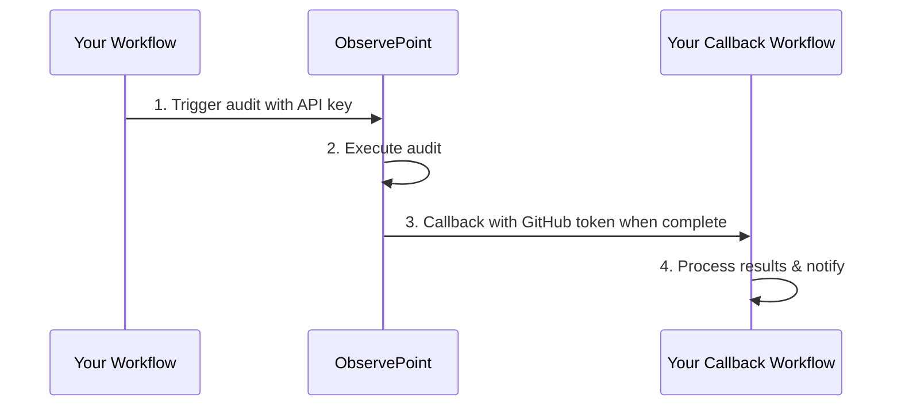

# ObservePoint GitHub Actions Integration

A GitHub Action that seamlessly integrates ObservePoint audits into your CI/CD pipeline, automatically triggering audits and handling results through callback workflows.

## 🚀 Features

- **Automated Audit Execution**: Trigger ObservePoint audits directly from your GitHub workflows
- **Secure Integration**: Uses encrypted secrets and fine-grained permissions
- **Callback Support**: Automatically triggers follow-up workflows when audits complete
- **PR Integration**: Works seamlessly with pull request workflows

## 🔄 How It Works



1. **Trigger Audit**: GitHub Action calls ObservePoint API with your audit configuration
2. **Execute Audit**: ObservePoint runs the specified audit on your URLs
3. **Callback**: Upon completion, ObservePoint triggers your callback workflow via GitHub API
4. **Process Results**: Your callback workflow handles the results and can notify your team


## 📋 Prerequisites

Before getting started, ensure you have:

- [ ] Active ObservePoint account with API access
- [ ] ObservePoint Audit ID - found in the URL of your audit's page
- [ ] GitHub repository with Actions enabled
- [ ] Repository admin access for secrets management

## 🔍 Finding Your Audit ID

1. Log in to ObservePoint
2. Navigate to your desired audit
3. The Audit ID is in the URL: `https://app.observepoint.com/audits/{AUDIT_ID}`


## ⚙️ Setup & Configuration

### Step 1: Get Your ObservePoint API Key

1. Log in to your ObservePoint account
2. Navigate to **Profile Settings**
3. Go to the **API Keys** section
4. Generate or copy your existing API key

### Step 2: Configure GitHub Secrets

Store your API key securely in your repository:

1. Navigate to your repository on GitHub
2. Click on the **Settings** tab (located at the top of your repository page)
3. In the left sidebar, scroll down to **Security** section
4. Click **Secrets and variables**
5. Select **Actions** from the dropdown menu
6. You'll see the **Repository secrets** section
7. Click the **New repository secret** button
8. Configure the secret:
   - **Name**: Enter `OBSERVEPOINT_API_KEY` (exactly as shown, case-sensitive)
   - **Secret**: Paste your ObservePoint API key value
9. Click **Add secret** to save

> 💡 **Note**: Repository secrets are encrypted and only accessible to workflows running in your repository. The API key will be masked in workflow logs for security.

### Step 3: Create GitHub Personal Access Token (PAT)

ObservePoint needs a PAT to trigger callback workflows:

1. Go to GitHub **Settings** → **Developer settings** → **Personal access tokens** → **Fine-grained tokens**
2. Click **Generate new token**
3. Configure the token:
   - **Name**: `ObservePoint Callback PAT`
   - **Repository access**: Select your target repository only
   - **Repository permissions**:
      - Actions: **Read and write** ✅
4. Generate and copy the token
5. **Securely provide this token to your ObservePoint administrator**

## 🔧 Implementation

### Primary Workflow Integration

Add this job to your existing CI/CD workflow (e.g., `.github/workflows/ci.yml`):

```yaml
jobs:
  # ... your existing jobs ...
  
  run_observepoint_audit:
    name: Run ObservePoint Audit
    runs-on: ubuntu-latest
    needs:
      - deploy  # Replace with your deployment job name
    steps:
      - name: Check out repository
        uses: actions/checkout@v4

      - name: Start ObservePoint audit
        uses: ./.github/actions/run_observepoint_audit
        with:
          audit_id: '{{ your audit ID }}'
          starting_urls: '{{ comma-separated list of starting URLs }}'
          OBSERVEPOINT_API_KEY: ${{ secrets.OBSERVEPOINT_API_KEY }}
          callback_owner: ${{ github.repository_owner }}
          callback_repo: ${{ github.event.repository.name }}
          callback_workflow_file: '{{ callback workflow filename }}'
          callback_ref: '{{ target branch }}'
          pr_number: ${{ github.event.pull_request.number }}
          commit_sha: ${{ github.sha }}
```

### Complete Example

```yaml
jobs:
  deploy:
    name: Deploy Application
    runs-on: ubuntu-latest
    # ... deployment steps ...

  run_observepoint_audit:
    name: Run ObservePoint Audit
    runs-on: ubuntu-latest
    needs:
      - deploy
    steps:
      - name: Check out repository
        uses: actions/checkout@v4

      - name: Start ObservePoint audit
        uses: ./.github/actions/run_observepoint_audit
        with:
          audit_id: '230171'
          starting_urls: 'https://edition.cnn.com/,https://us.cnn.com/'
          OBSERVEPOINT_API_KEY: ${{ secrets.OBSERVEPOINT_API_KEY }}
          callback_owner: ${{ github.repository_owner }}
          callback_repo: ${{ github.event.repository.name }}
          callback_workflow_file: 'audit-complete.yml'
          callback_ref: 'main'
          pr_number: ${{ github.event.pull_request.number }}
          commit_sha: ${{ github.sha }}
```

### Callback Workflow

Create `.github/workflows/audit-complete.yml` to handle audit completion:

```yaml
name: Audit Complete Handler

on:
  workflow_dispatch:
    inputs:
      audit_results:
        description: 'ObservePoint audit results'
        required: true
        type: string
      pr_number:
        description: 'Pull request number'
        required: false
        type: string

jobs:
  process_results:
    name: Process Audit Results
    runs-on: ubuntu-latest
    steps:
      - name: Check out repository
        uses: actions/checkout@v4
      
      - name: Process audit results
        run: |
          echo "Audit completed!"
          echo "Results: ${{ github.event.inputs.audit_results }}"
          
      # Add your custom result processing logic here
      # Examples:
      # - Send notifications
      # - Update PR status
      # - Generate reports
      # - Fail the workflow if issues found
```

### Complete Example Of Callback Workflow

```yaml
name: ObservePoint – audit complete

on:
  workflow_dispatch:
    inputs:
      audit_id:
        description: "ObservePoint audit ID"
        required: true
      run_id:
        description: "ObservePoint audit run ID"
        required: true
      alerts_triggered:
        description: "Number of alerts triggered"
        required: true
        type: number
      audit_run_ui_link:
        description: "Link to audit run UI"
        required: true
      context:
        description: "Context JSON object (repo, branch, commit hash, etc.)"
        required: true

jobs:
  audit-complete:
    runs-on: ubuntu-latest
    steps:
      - name: Process audit completion
        run: |
          echo "🔍 Processing audit completion..."
          echo "Audit ID: ${{ inputs.audit_id }}"
          echo "Run ID: ${{ inputs.run_id }}"
          echo "Alerts Triggered: ${{ inputs.alerts_triggered }}"
          echo "Audit Run UI: ${{ inputs.audit_run_ui_link }}"
          echo "Context: ${{ inputs.context }}"

      - name: Check audit result
        run: |
          if [ "${{ inputs.alerts_triggered }}" -gt 0 ]; then
            echo "❌ Audit failed - ${{ inputs.alerts_triggered }} alert(s) were triggered"
            echo "::error::Audit ${{ inputs.audit_id }} (Run: ${{ inputs.run_id }}) failed with ${{ inputs.alerts_triggered }} alert(s)"
            echo "::notice::View details: ${{ inputs.audit_run_ui_link }}"
            exit 1
          else
            echo "✅ Audit passed – no alerts triggered"
            echo "::notice::Audit ${{ inputs.audit_id }} (Run: ${{ inputs.run_id }}) completed successfully"
            echo "::notice::View details: ${{ inputs.audit_run_ui_link }}"
          fi
```

## 📊 Input Parameters

| Parameter | Required | Description | Example |
|-----------|----------|-------------|---------|
| `audit_id` | ✅ | ObservePoint audit ID | `'230171'` |
| `starting_urls` | ✅ | Comma-separated list of URLs to audit | `'https://example.com,https://app.example.com'` |
| `OBSERVEPOINT_API_KEY` | ✅ | ObservePoint API key (use secret) | `${{ secrets.OBSERVEPOINT_API_KEY }}` |
| `callback_owner` | ✅ | GitHub repository owner | `${{ github.repository_owner }}` |
| `callback_repo` | ✅ | Repository name | `${{ github.event.repository.name }}` |
| `callback_workflow_file` | ✅ | Callback workflow filename | `'audit-complete.yml'` |
| `callback_ref` | ✅ | Branch/ref for callback | `'main'` |
| `pr_number` | ❌ | Pull request number (if applicable) | `${{ github.event.pull_request.number }}` |
| `commit_sha` | ❌ | Commit SHA for reference | `${{ github.sha }}` |

## 📚 Examples

### Basic Single Audit
```yaml
- uses: ./.github/actions/run_observepoint_audit
  with:
    audit_id: '230171'
    starting_urls: 'https://example.com'
    OBSERVEPOINT_API_KEY: ${{ secrets.OBSERVEPOINT_API_KEY }}
    callback_owner: ${{ github.repository_owner }}
    callback_repo: ${{ github.event.repository.name }}
    callback_workflow_file: 'audit-complete.yml'
    callback_ref: 'main'
```

### Single Audit with Multiple URLs

```yaml
- uses: ./.github/actions/run_observepoint_audit
  with:
    audit_id: '230171'
    starting_urls: 'https://example.com,https://app.example.com,https://api.example.com'
    OBSERVEPOINT_API_KEY: ${{ secrets.OBSERVEPOINT_API_KEY }}
    callback_owner: ${{ github.repository_owner }}
    callback_repo: ${{ github.event.repository.name }}
    callback_workflow_file: 'audit-complete.yml'
    callback_ref: 'main'
```

> 💡 **Note**: The audit will run against all provided starting URLs

## 🐛 Troubleshooting

### Common Issues

**Audit not triggering:**
- Verify your `OBSERVEPOINT_API_KEY` secret is correctly set
- Check that the audit ID exists and is accessible with your API key

**Callback not working:**
- Ensure the PAT has been provided to ObservePoint
- Verify the PAT has `Actions: Read and write` permissions
- Check that the callback workflow file exists and is valid

**Workflow fails:**
- Review GitHub Actions logs for detailed error messages
- Verify all required parameters are provided
- Ensure the repository has Actions enabled

## 🔗 Related Resources

- [ObservePoint API Documentation](https://developer.observepoint.com/)
- [GitHub Actions Documentation](https://docs.github.com/en/actions)
- [Example Callback Workflow](./workflows/audit-complete.yml)

## 📞 Support

- **Issues**: [GitHub Issues](../../issues)
- **ObservePoint Support**: Contact your customer success manager
- **Documentation**: [ObservePoint Help Center](https://help.observepoint.com/)

---

> 🚧 **Coming Soon**: This action will be published to the GitHub Marketplace for easier installation.
