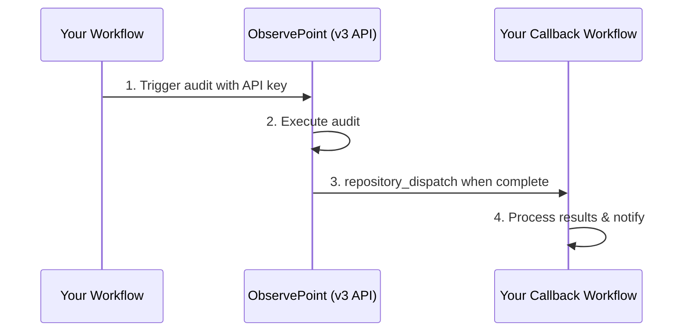

# ObservePoint GitHubActions Integration (v3)

A GitHubAction that seamlessly integrates ObservePoint web‑audits into your CI/CD pipeline via the **v3** API, automatically triggering audits and forwarding rich context to downstream workflows.

---

## 🚀Features

* **AutomatedAudit Execution**– start ObservePoint audits directly from your GitHub workflows.
* **Secure Integration**– leverages encrypted secrets and fine‑grained permissions only (no full‑repo PATs required).
* **Rich Callback Context**– passes detailed `callbackContext` data (PR, commit, env, etc.) to your callback workflow via **repository\_dispatch**.
* **PR Integration**– fits naturally into pull‑request pipelines and can update PR status/comments on completion.

---

## 🔄How It Works



1. **Trigger Audit**– the action calls the ObservePointv3API with your audit settings.
2. **Execute Audit**– ObservePoint runs the audit against the supplied starting URLs.
3. **Repository Dispatch**– on completion, ObservePoint fires a `repository_dispatch` event (using your PAT) containing all audit metadata plus your custom `callbackContext`.
4. **Process Results**– your callback workflow analyses the payload, notifies teams, updates PRs, fails/approves builds, etc.

---

## 📋Prerequisites

* [ ] Active ObservePoint account **with v3 API access**
* [ ] AuditID of the web‑audit you want to run
* [ ] GitHubrepository with Actions enabled
* [ ] Repository admin rights (to add secrets & fine‑grained PAT)

---

## 🔍Finding Your AuditID

1. Log in to ObservePoint.
2. Navigate to the audit you wish to run.
3. The AuditID is the final segment in the URL:

   ```text
   https://app.observepoint.com/audits/{AUDIT_ID}
   ```

---

## ⚙️Setup & Configuration

\###1·Generate an ObservePointAPIKey

1. Log in to ObservePoint.
2. Open **Profile & Permissions.
3. Generate a new key or copy an existing one.

\###2·Add the APIKey as a GitHubSecret

> **Case matters.**The key must be stored as `observepoint_api_key` (lower‑case) to match the action’s input name.

1. Go to **Repo→ Settings→Security→Secrets and Variables→Actions**.
2. Click **Newrepository secret**.
3. **Name**: `observepoint_api_key`
   **Secret**: *paste the APIkey value*.
4. Click **Addsecret**.

\###3·Create a Fine‑GrainedPAT for Callbacks

ObservePoint uses a PAT to dispatch the callback; it needs only minimal scope.

1. **GitHub→ Settings → Developersettings → Personal access tokens → Fine‑grained tokens**.
2. **Generate new token**.
3. Configure:

    * **Name**: `ObservePoint‑Callback‑PAT`
    * **Repositoryaccess**: *select the target repo only*
    * **Repositorypermissions**:
      • **Contents**:Read ✓•**Metadata**:Read ✓
4. Generate & copy the token.
5. Provide the token to your ObservePoint administrator for one‑time vault entry.

> ℹ️`repository_dispatch` needs only **read** scopes – safer than `workflow_dispatch`.

---

## 🔧Implementation

### Primary WorkflowJob

Add this job (or replace the legacy one) in your pipeline, e.g. `.github/workflows/ci.yml`:

```yaml
jobs:
  # … your existing jobs …

  run_observepoint_audit:
    name: Run ObservePoint Audit
    runs-on: ubuntu-latest
    needs:
      - deploy          # change to your last upstream job
    steps:
      - name: Check out repository
        uses: actions/checkout@v4

      - name: Start ObservePoint audit (v3)
        uses: ./.github/actions/run_observepoint_audit
        with:
          audit_id: 'YOUR_AUDIT_ID'
          starting_urls: 'https://example.com/,https://api.example.com/'
          observepoint_api_key: ${{ secrets.observepoint_api_key }}
          callback_owner: ${{ github.repository_owner }}
          callback_repo:  ${{ github.event.repository.name }}
          callback_event_type: 'observepoint-audit-complete'
          callback_ref:   'main'
          pr_number:      ${{ github.event.pull_request.number }}
          commit_sha:     ${{ github.sha }}
          # Optional user data merged into callbackContext
          callback_context_json: >
            {
              "env": "staging"
            }
```

### Complete Workflow Example (build → test → deploy → audit)

```yaml
name: Call ObservePoint Audit

on:
  push:
    branches: [main]

permissions:
  contents: read
  actions:  write
  pull-requests: write

jobs:
  build:
    runs-on: ubuntu-latest
    steps:
      - run: echo "🏗️  Building…" && sleep 2

  test:
    runs-on: ubuntu-latest
    needs: build
    steps:
      - run: echo "✅  Testing…" && sleep 2

  deploy:
    runs-on: ubuntu-latest
    needs: test
    steps:
      - run: echo "🚀  Deploying…" && sleep 2

  run_observepoint_audit:
    runs-on: ubuntu-latest
    needs: deploy
    steps:
      - uses: actions/checkout@v4

      - name: Start ObservePoint audit (v3)
        uses: ./.github/actions/run_observepoint_audit
        with:
          audit_id: '1149283'
          starting_urls: 'https://dominos.ua/uk/kyiv,https://dominos.ua/'
          observepoint_api_key: ${{ secrets.observepoint_api_key }}
          callback_owner: ${{ github.repository_owner }}
          callback_repo:  ${{ github.event.repository.name }}
          callback_event_type: 'observepoint-audit-complete'
          callback_ref: 'main'
          pr_number:  ${{ github.event.pull_request.number }}
          commit_sha: ${{ github.sha }}
          callback_context_json: >
            {
              "env": "staging"
            }
```

### Callback Workflow

Save as `.github/workflows/audit-complete.yml`:

```yaml
name: Audit Complete Handler

on:
  repository_dispatch:
    types: [observepoint-audit-complete]

jobs:
  process_results:
    runs-on: ubuntu-latest
    steps:
      - uses: actions/checkout@v4

      - name: Process audit results
        run: |
          echo "🔍 Processing audit completion…"
          echo "Audit ID:         ${{ github.event.client_payload.audit_id }}"
          echo "Run ID:           ${{ github.event.client_payload.run_id }}"
          echo "Alerts Triggered: ${{ github.event.client_payload.alerts_triggered }}"
          echo "UI Link:          ${{ github.event.client_payload.audit_run_ui_link }}"
          echo "Context JSON:     ${{ toJson(github.event.client_payload.context) }}"

      - name: Fail build on alerts
        run: |
          if [ "${{ github.event.client_payload.alerts_triggered }}" -gt 0 ]; then
            echo "❌ Audit failed – alerts detected"
            exit 1
          else
            echo "✅ Audit passed – no alerts"
          fi
```

---

## 📊Input Parameters

| Parameter               | Required | Description                                       | Example                                         |
| ----------------------- | -------- | ------------------------------------------------- | ----------------------------------------------- |
| `audit_id`              | ✅        | ObservePoint audit ID to start                    | `'1149283'`                                     |
| `starting_urls`         | ✅        | Comma‑separated list of starting URLs             | `'https://example.com,https://app.example.com'` |
| `observepoint_api_key`  | ✅        | ObservePoint API key (secret)                     | `${{ secrets.observepoint_api_key }}`           |
| `callback_owner`        | ✅        | GitHub organisation/user owning the callback repo | `${{ github.repository_owner }}`                |
| `callback_repo`         | ✅        | Repository name containing the callback workflow  | `${{ github.event.repository.name }}`           |
| `callback_event_type`   | ✅        | Event type for `repository_dispatch`              | `'observepoint-audit-complete'`                 |
| `callback_ref`          | ✅        | Git ref / branch on which to run the callback     | `'main'`                                        |
| `callback_context_json` | ❌        | JSON (string) merged into `callbackContext`       | `'{"env":"staging"}'`                           |
| `pr_number`             | ❌        | Pull‑request number (omit on push)                | `${{ github.event.pull_request.number }}`       |
| `commit_sha`            | ❌        | Commit SHA for traceability                       | `${{ github.sha }}`                             |

---

## 📚Usage Examples

\###Single Audit, Single URL

```yaml
- uses: ./.github/actions/run_observepoint_audit
  with:
    audit_id: '1149283'
    starting_urls: 'https://example.com'
    observepoint_api_key: ${{ secrets.observepoint_api_key }}
    callback_owner: ${{ github.repository_owner }}
    callback_repo:  ${{ github.event.repository.name }}
    callback_event_type: 'observepoint-audit-complete'
    callback_ref: 'main'
```

\###Single Audit, Multiple URLs & Custom Context

```yaml
- uses: ./.github/actions/run_observepoint_audit
  with:
    audit_id: '1149283'
    starting_urls: 'https://example.com,https://app.example.com,https://api.example.com'
    observepoint_api_key: ${{ secrets.observepoint_api_key }}
    callback_owner: ${{ github.repository_owner }}
    callback_repo:  ${{ github.event.repository.name }}
    callback_event_type: 'observepoint-audit-complete'
    callback_ref: 'main'
    callback_context_json: '{"env":"prod","deploymentId":"42"}'
```

> 💡The audit runs against **all** provided URLs, and your custom JSON is merged into the callback payload.

---

## 🐛Troubleshooting

### Audit not starting

* Ensure `observepoint_api_key` secret exists and is valid.
* Confirm the audit ID exists and belongs to your account.
* Check workflow logs for HTTP4xx/5xx responses.

### Callback not received

* Verify the PAT was registered with ObservePoint.
* Confirm the PAT has **Contents/ Metadata***read* scopes only.
* Ensure the callback workflow listens for the exact `callback_event_type`.

### Workflow failures

* Review the JSON payload printed by the callback workflow.
* Make sure all **required inputs** are supplied.
* Confirm Actions are enabled for the repository.

---

## 🔗Related Resources

* **ObservePointAPIDocs** – [https://developer.observepoint.com/](https://developer.observepoint.com/)
* **GitHubActions** – [https://docs.github.com/en/actions](https://docs.github.com/en/actions)
* **Repository Dispatch API** – [https://docs.github.com/en/rest/repos/repos#create-a-repository-dispatch-event](https://docs.github.com/en/rest/repos/repos#create-a-repository-dispatch-event)

---

## 📞Support

* **Raise Issues** – open a ticket in this repo’s *Issues* tab.
* **ObservePointSupport** – contact your CustomerSuccessManager.
* **Docs & Guides** – [https://help.observepoint.com/](https://help.observepoint.com/)

---

> 🚧**Coming Soon**– this action will be published on the GitHubMarketplace for one‑click installation.
